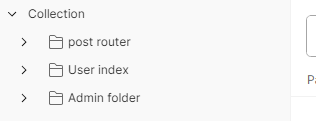
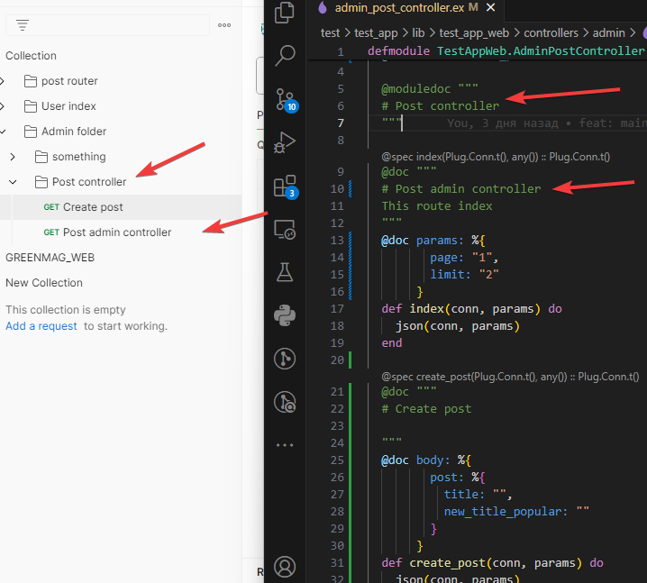
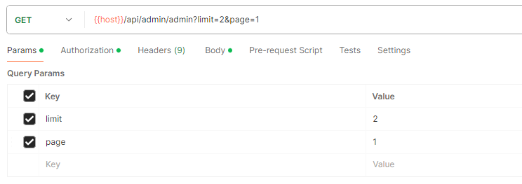
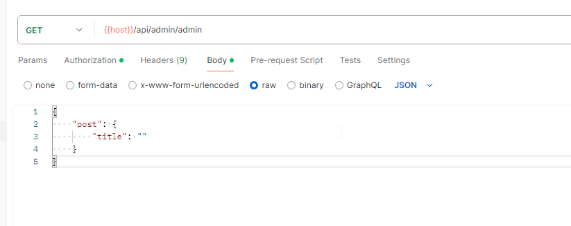

# FastPostmanCollection

This library exists for generate your collection by Phoenix Router `MyApp.Router`.
You can write your documentation by `@doc`
This library release this scheme: https://schema.postman.com/
Example generative your collection:


## Installation

If [available in Hex](https://hex.pm/docs/publish), the package can be installed
by adding `fast_postman_collection` to your list of dependencies in `mix.exs`:

```elixir
def deps do
  [
    {:fast_postman_collection, "~> 0.1.0"}
  ]
end
```

Configure fast collection

- pipe_tokens -> put in your auth bearer
- router -> your router
- variables -> variables collection
- file_path_collection -> rewrite where will be your file collection

```elixir
config(:fast_postman_collection,
  pipe_tokens: [:admin_auth, :user_auth],
  name_collection: "My collection",
  router: MyApp.Router,
  variables: [
    %{
      key: "host",
      value: "http://localhost:4000"
    }
  ]
)
```

configure your controller

```elixir
defmodule TestAppWeb.UserController do
  use TestAppWeb, :controller
  @moduledoc filter: "test"
  # Artem will be name in collection
  @moduledoc """
  # Artem
  """
  # Index route will be name in collection
  @doc """
  # Index route
  This route will be in collection
  """
  @doc params: %{
    limit: 0,
    page: %{
      key: "page",
      value: 1,
      description: "artem"
    },
  }
  def index(conn, params) do
    json(conn, params)
  end
end
```

And just use `mix fs.get_collection`

Documentation can be generated with [ExDoc](https://github.com/elixir-lang/ex_doc)
and published on [HexDocs](https://hexdocs.pm). Once published, the docs can
be found at <https://hexdocs.pm/fast_postman_collection>.

## How to write documenation

### naming



```elixir
@moduledoc """
# Post controller
"""
# Create post go to naming
 @doc """
  # Create post
  this description go to doc !!!!!
  """


```

if you don't pass @doc with # FastPostmanCollection pass module name or function name

### params

This will be put on your url as limit?=10

```elixir
@doc params: %{
    limit: 0,
    page: %{
      key: "page",
      value: 1,
      description: "artem"
    },
  }
  def index(conn, params) do
    json(conn, params)
  end
```


This will be put on your body and automate mode will be json

```elixir
 @doc """
  # Create post

  """
  @doc body: %{
         post: %{
           title: ""
         }
       }
  def create_post(conn, params) do
    json(conn, params)
  end
```


fomdata options

```elixir
 @doc mode: "formdata"
@doc formdata: [
         %{
           key: "image",
           value: nil,
           type: "file"
         }
       ]
```

## About authrization

All tokens puts and scans from your pipelines

### example

router.ex

```elixir
 scope "/user" do
      pipe_through(:admin_auth)
      get("/", UserController, :index)
end
```

config.exs

```elixir
 scope "/user" do
      pipe_through(:admin_auth)
      get("/", UserController, :index)
end
```

will be there in bearer in token


And use for put your token

```elixir
 @doc auth_pre_request: %{is_enabled: true, from_resp_token: "token", variable_token: "admin_variable"}
```

## about folder

You can use `@moduledoc folder_path: "Admin"`
and this put your module function to this folder

### Example

```elixir
defmodule MyAppWeb.AdminUserController do
  use MyAppWeb, :controller
  @moduledoc folder_path: "Admin"
  # this module puts to /admin/user controller
  @moduledoc """
  # user controller
  """

end
```

## mix commands

mix fs.get_collection:
This command generate in your directory file with collection

## Todo

- [ ] filtering in mix fs.get_collection
- [ ] more testing structs generate
